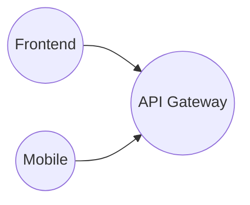
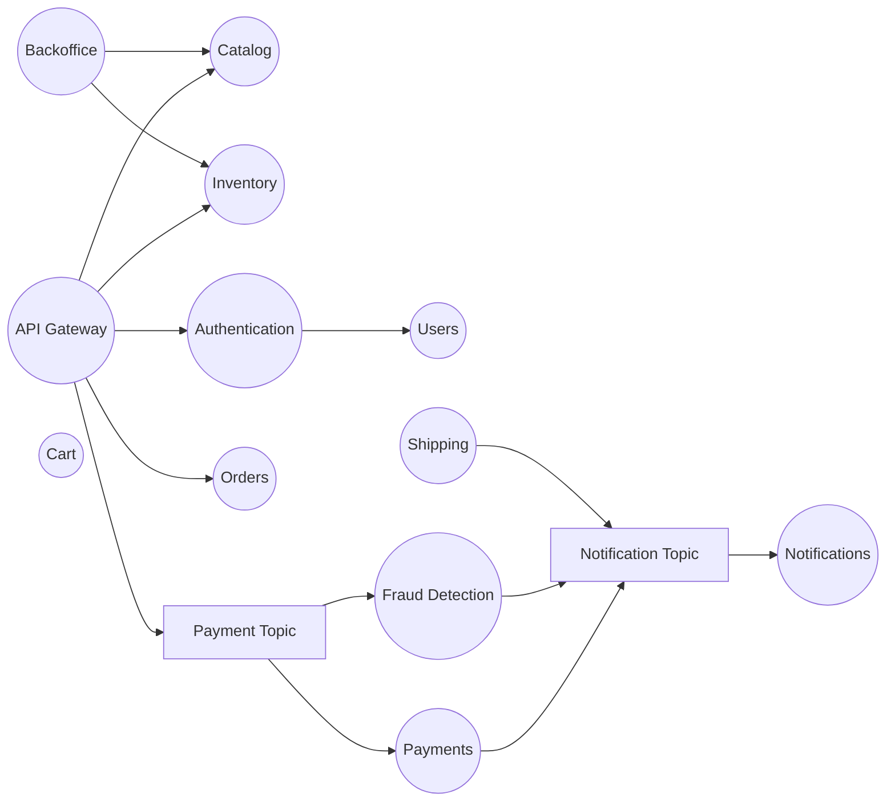

# Architecture
Overengineered Ecommerce Architecture

```mermaid
graph LR;
    Frontend((Frontend)) --> Gateway((API Gateway))
    Mobile((Mobile)) --> Gateway((API Gateway))
    

    
```

```mermaid
graph LR;

    Catalog((Catalog))
    
    
    
    Gateway((API Gateway)) --> Inventory((Inventory))
    Backoffice((Backoffice)) --> Inventory((Inventory))
    Auth((Authentication)) --> Users((Users))
    Gateway((API Gateway)) --> Auth((Authentication))
    Gateway((API Gateway)) --> Catalog((Catalog))
    Backoffice((Backoffice)) --> Catalog((Catalog))
    Gateway((API Gateway)) --> Orders((Orders))
    Gateway((API Gateway)) --> paymentTopic[Payment Topic]
    paymentTopic --> Payments((Payments))
    paymentTopic --> Fraud((Fraud Detection))
    
    Payments((Payments)) --> notificationTopic[Notification Topic]
    Fraud --> notificationTopic[Notification Topic]
    notificationTopic --> Notifications((Notifications))
    Shipping((Shipping)) --> notificationTopic
    
    Cart((Cart))

```