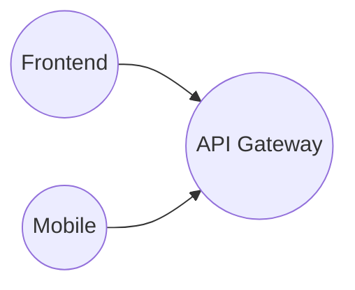
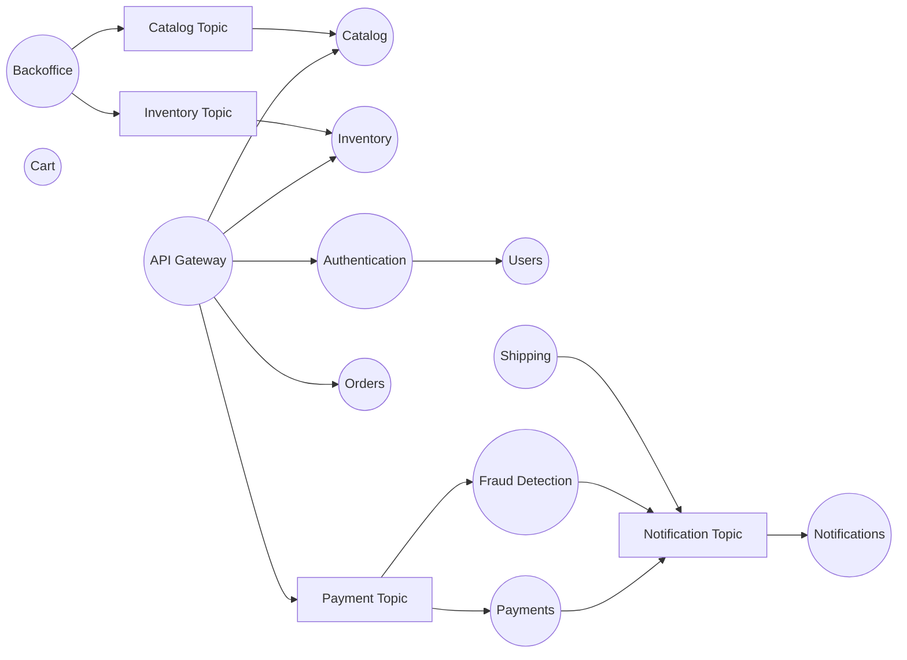

# Architecture
Overengineered Ecommerce Architecture

| Service               | Description                               | Tech Stack                                  | Why?                                                                                   | Multi-Threading?                                      | Approach                                                                            |
|-----------------------|-------------------------------------------|---------------------------------------------|-----------------------------------------------------------------------------------------|------------------------------------------------------|-------------------------------------------------------------------------------------|
| Catalog Service       | Manages product catalog and categories                 | Spring Boot, Postgresql (Persisting a hashmap for details)), OpenSearch, Cucumber, TestContainers                              | OpenSearch enhances search capabilities.                                             |                                                      |                                                                                     |
| Inventory Service     | Manages product inventory                | Spring Boot, PostgreSQL, Redis, OpenSearch | PostgreSQL ensures structured product data, Redis speeds up frequently accessed data.   | Concurrent updates on product stock levels (high-volume traffic) | Use Optimistic Locking (PostgreSQL) or Redis transactions                          |
| API Gateway           | Manages authentication, request routing  | Spring Cloud Gateway                       | Centralized entry point for all requests, enabling security, rate limiting, and load balancing. |                                                      | (Spring Cloud Gateway RateLimiter)                                                  |
| Authentication Service| Handles user authentication (JWT, OAuth2)| Spring Security, Keycloak, PostgreSQL      | Ensures secure authentication with JWT tokens and role-based access control.           |                                                      |                                                                                     |
| User Service          | Stores user profiles, addresses, orders | Spring Boot, PostgreSQL                    | Structured storage for user data with ACID compliance for consistency.                  |                                                      |                                                                                     |
| Cart Service          | Stores shopping cart items, wishlist    | Spring Boot, Redis                         | Redis provides fast in-memory storage for quick cart retrieval and session persistence. |                                                      |                                                                                     |
| Order Service         | Processes orders, manages order status  | Spring Boot, PostgreSQL, Kafka             | Kafka ensures event-driven order processing, PostgreSQL maintains transactional integrity. | Multiple orders need to be validated and saved in parallel | Use ExecutorService or Virtual Threads for concurrent order processing             |
| Payment Service       | Handles payments, refunds, invoicing     | Spring Boot, Kafka, PostgreSQL             | Kafka manages asynchronous payment processing, ensuring reliability, and PostgreSQL handles secure transaction storage. | Payments involve multiple I/O operations (bank API calls, database updates) | Virtual Threads for handling many blocking I/O calls efficiently                   |
| Shipping Service      | Tracks shipments, integrates with couriers| Spring Boot, Kafka, PostgreSQL            | Kafka ensures real-time shipment updates, PostgreSQL provides reliable storage.         |                                                      |                                                                                     |
| Notification Service  | Sends order confirmations, updates      | Spring Boot, Kafka, Redis                  | Kafka ensures reliable event-based notifications, and Redis speeds up message processing. | Thousands of SMS/email notifications sent asynchronously | Spring Boot Async, Kafka Consumers                                                 |
| Search & Analytics    | Enables product search, sales reports   | Spring Boot, Kafka, OpenSearch          | OpenSearch provides fast, full-text search, and Kafka streams enable real-time analytics. | Product updates should be indexed asynchronously in OpenSearch | Use Kafka consumers + Multi-threaded workers                                       |
| Fraud Detection       | Large-scale transaction monitoring       | Kafka Streams                              | Real-time parallel processing of large-scale transactions for fraud detection.          |                                                      | Kafka Streams + Virtual Threads for event processing                               |

## DevOps & Scalability

| Area                      | Best Practices                                      |
|---------------------------|-----------------------------------------------------|
| Test                      | TestContainers, Cucumber, Sonarqube                 |
| Observability             | Grafana/Prometheus/Loki/tracing/metrics, Spring Cloud|
| Containerization          | Use Docker for each microservice, JIB              |
| Orchestration             | Deploy with Kubernetes (K8s) for auto-scaling      |
| CI/CD Pipeline            | Automate builds & deployment with GitHub Actions  |
| Blue-Green Deployment     | Reduce downtime by deploying updates gradually    |

| Pekko                      |                                   |
|---------------------------|-----------------------------------------------------|
| Actors                      |  Actor Behaviour, Stash, Actor Supervisor         |
| Streams                      |             |
| Clusters                      | Split Brain Resolver            |
| Shard                      |             |
| Pekko Management                      |             |

